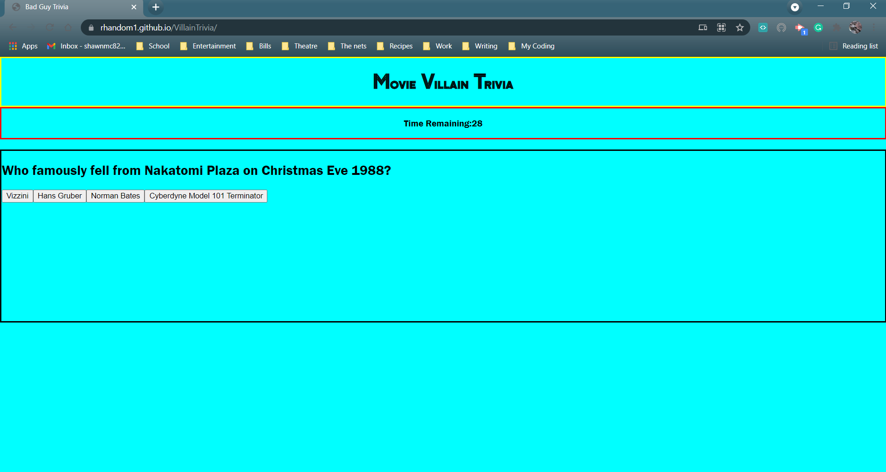

# Trivia Game

## Purpose

The purpose of this task is to create a trivia game on any subject. The game must include a timer, mulitple choice answers, a way to keep score, and the ability to enter the players intials once the game is complete.

### Acceptance Criteria

GIVEN I am taking a code quiz
WHEN I click the start button
THEN a timer starts and I am presented with a question
WHEN I answer a question
THEN I am presented with another question
WHEN I answer a question incorrectly
THEN time is subtracted from the clock
WHEN all questions are answered or the timer reaches 0
THEN the game is over
WHEN the game is over
THEN I can save my initials and my score

## Screnshot and links

Live site: https://rhandom1.github.io/VillainTrivia/

To see the complete code setup: https://github.com/Rhandom1/VillainTrivia

